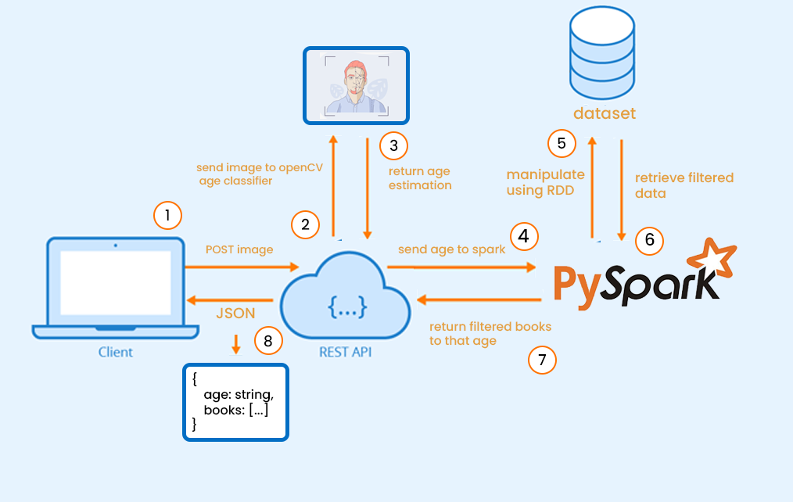
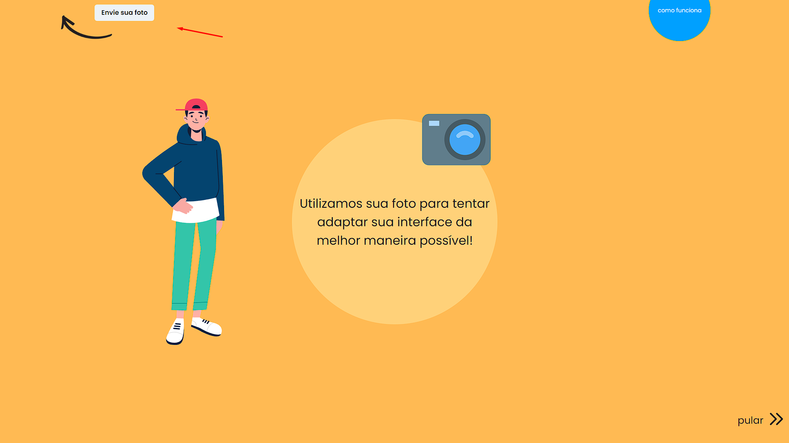

# Readapt


Readapt é uma aplicação de leitura de Ebooks feita com o objetivo de se adequar ao usuário. A partir de uma foto do usuário, o programa estima a idade do usuário e aplica um filtro de ebooks, bem como um filtro de dispersão de conteúdo.

Foi utilizada a linguagem de programação Python para a construção do servidor, o framework flask para a implementação REST, a biblioteca openCV para o treinamento de modelos de imagem e o framework de computação distribuida pySpark para a construção do modelo de recomendação, sendo ele mantido e filtrado em dataframe.

### Arquitetura





### Funcionamento

1. O cliente envia uma imagem para o servidor por POST pela rota /upload.
2. O servidor recebe a imagem  e envia para o classificador de idade do openCV.
3. O classificador retorna a idade estimada do usuário.
4. O servidor envia a idade estimada para o sistema de recomendação de ebooks do pySpark.
5. O sistema de recomendação, através do RDD(Resilient Distributed Datasets) manipula o dataset de ebooks com base na idade estimada do usuário.
6. São retornados os ebooks recomendados/filtrados.
7. A função do pySpark envia o Dataframe de recomendação para o servidor.
8. O servidor retorna o Dataframe de recomendação para o cliente, juntamente com a idade estimada.


### Motulos utilizados

- [Opencv-python](https://pypi.org/project/opencv-python/) - Biblioteca de código aberto para o processamento de imagens.
- [Flask](https://flask.palletsprojects.com/en/1.1.x/) - Framework de desenvolvimento web.
- [PySpark](https://spark.apache.org/docs/latest/api/python/) - Framework de código aberto para o processamento de dados.
- [Numpy](https://numpy.org/) - Biblioteca de código aberto para o processamento de dados.
- [OS](https://docs.python.org/3/library/os.html) - Biblioteca de código aberto para o operação de sistema.
### Como utilizar o Readapt

#### Cliente:
```
~$ npm i
~$ yarn dev
```

#### Servidor:

```
~$ pip install pyspark
~$ pip install flask
~$ pip install opencv-python
~$ pip install numpy
~$ python ./backend/app.py
```

## Feito isso, basta enviar sua foto pelo cliente e utilizar a aplicação!
